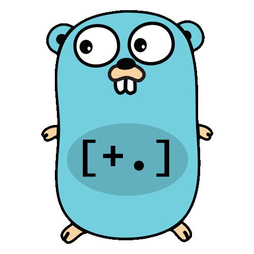

<div align="center">

#  Go-Fck
A Brainfck implementation in written in Go


</div>

## What is Go-Fck
Go-Fck is the worlds most memory efficient brainfuck implementation.
We support file linking, so your brainfuck project can scale to your development
team. This project ships two binaries, `bf` and `bfc`. 

### `bfc`
Brainfuck compile, or `bfc` compiles your brainfuck into an optimized "binary"
that can be ran with `bf` or ran through any external brainfuck interpretter.
It generates a two line file of a dynamic symbol table and raw brainfuck code.
`bfc` will link multiple `.bf` files together in a larger project into a single binary.
### `bf`
The brainfuck command, or `bf` is a brainfuck interpretter that accepts 
any form of valid brainfuck. This is commonly paired with `bfc` to run compiled brainfuck
in a more efficient manner. The workflow would look something like the following:

```bash
bfc main.bf linkable.bf function.bf -o program.bin
bf program.bin
> Hello World!
```

`bf` can only run single-file source-code programs. 
If your team is running more than one file, you must compile your
program with `bfc` first.  This ensures compatability with other brainfuck
interpretters

## Getting Started

### Pre-requisites
- Golang >= `1.23.3`
- Probably Linux


